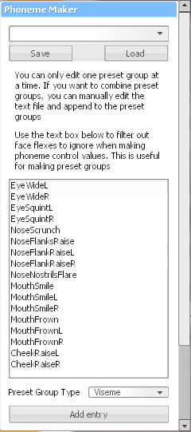

# Phoneme Maker <!-- omit from toc -->

Make phoneme, viseme, or emotion presets for the Phoneme Tool

## Table of Contents <!-- omit from toc -->

- [Description](#description)
  - [Features](#features)
  - [Rational](#rational)
- [Disclaimer](#disclaimer)
- [Pull Requests](#pull-requests)

## Description

This adds a floating Phoneme Maker panel to the left of the context menu, which allows one to make own preset groups for the Phoneme Tool

### Features

- **Presets**: Load preset groups from the Phoneme Tool
- **Preview**: Preview each phoneme/viseme/emotion entry
- **Filter**: Ignore certain flexes when making visemes or emotions

### Rational

The Phoneme Tool does not come with its own phoneme/viseme/emotion generator for GMod; these can only be generated through Source Filmmaker, and by extension through Valve's Faceposer application. This addon reduces reliance on old programs to make phoneme presets; it allows the user to directly make them in GMod.

## Disclaimer

**This tool has been tested in singleplayer.** Although this tool may function in multiplayer, please expect bugs and report any that you observe in the issue tracker.

## Pull Requests

When making a pull request, make sure to confine to the style seen throughout. Try to add types for new functions or data structures. I used the default [StyLua](https://github.com/JohnnyMorganz/StyLua) formatting style.
